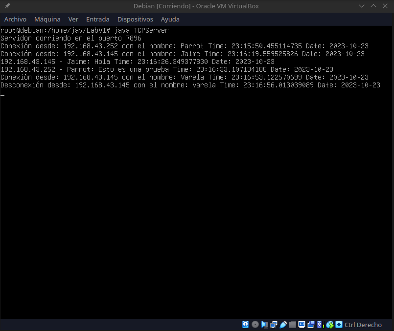
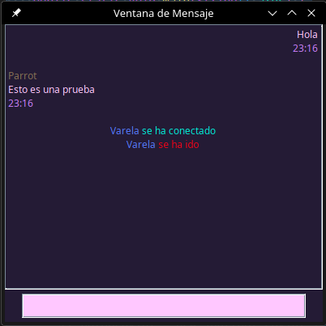

# Chat-TCP
Un simple chat grupal desarrollado en Java con TCP.

Chat-TCP es una aplicación de chat cliente-servidor que utiliza el protocolo TCP para la comunicación entre clientes y un servidor. Esta aplicación te permite enviar y recibir mensajes, recibir notificaciones de conexión y desconexión de usuarios y mantener un registro de eventos.

## Instrucciones de Uso
### Servidor
```bash
# Compilar el proyecto
javac TCPServer.java

# Iniciar el servidor
java TCPServer
```
### Cliente
Recuerda cambiar la dirección IP por la de tu servidor.

Para que los sonidos se reproduzcan debe de estar en la misma ubicación que el código.
```bash
# Compilar el proyecto
javac TCPClient.java

# Iniciar el cliente
java TCPClient
```
Disfruta de este sencillo chat.

### Capturas
<center>
<table style="border: none; text-align: center;">
  <tr>
    <td></td>
    <td></td>
  </tr>
</table>
</center>

Los sonidos utilizados fueron obtenidos de https://directory.audio/es/
